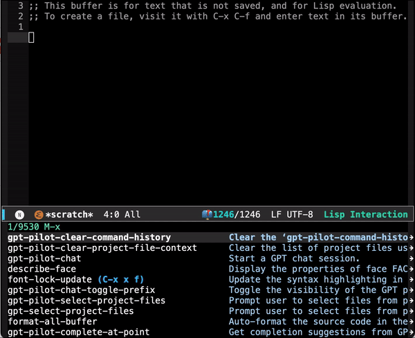
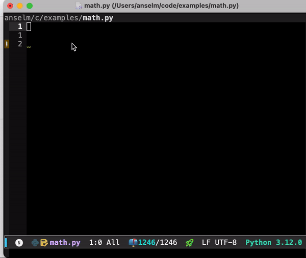
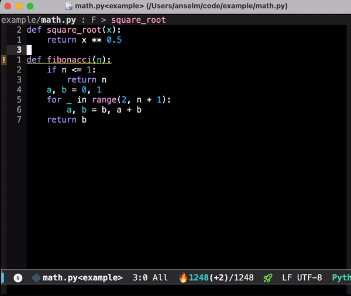
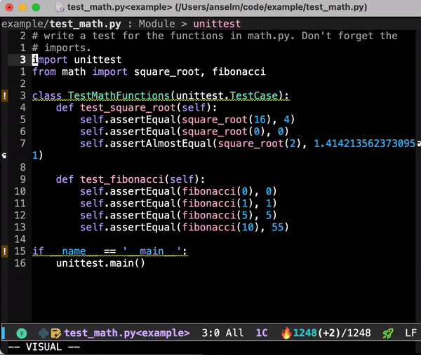

# gpt-pilot.el

gpt-pilot.el is a comprehensive Emacs package for interacting with large language models like GPT-4 and Claude 3.5 Sonnet. It's a feature-rich fork of [gpt.el](https://github.com/stuhlmueller/gpt.el) that adds project awareness, better chat management, and more sophisticated completion capabilities.

The aim is to make sure emacs stays up-to-date with modern LLM support.

## Features

- **Multiple Chat Sessions**: Create and manage multiple named chat sessions with different models
- **Completion at Point**: Get context-aware completions as you type
- **Region Transformations**: Transform selected text using natural language commands
- **Project Context**: Include relevant project files as context for better responses
- **Chat History Management**: Save, browse, and manage your chat history
- **Multiple Model Support**: Switch between OpenAI and Anthropic models seamlessly

| Chat Interface                                         | Completion at point                                                              |
|--------------------------------------------------------|----------------------------------------------------------------------------------|
|  |  |

| Project Context                                                        | Region Transformation                                                   |
|------------------------------------------------------------------------|-------------------------------------------------------------------------|
|  |  |


## Installation

### Prerequisites

You'll need Python packages for the API clients:

```bash
pip install openai anthropic jsonlines
```
You don't need to install all of them, but minimally `openai` or `anthropic`.

You'll also need API keys from [OpenAI](https://beta.openai.com/) and/or [Anthropic](https://console.anthropic.com).

### From MELPA
TODO

```elisp
(require 'package)
(add-to-list 'package-archives '("melpa" . "https://melpa.org/packages/") t)
(package-install 'gpt-pilot)
```

### Using use-package
TODO

```elisp
(use-package gpt-pilot
  :ensure t
  :config
  (setq gpt-pilot-openai-key "your-openai-key-here")
  (setq gpt-pilot-anthropic-key "your-anthropic-key-here"))
```

## Configuration

Basic configuration:

```elisp
;; API Keys
(setq gpt-pilot-openai-key "sk-...")
(setq gpt-pilot-anthropic-key "sk-ant-...")

;; Model Parameters (optional)
(setq gpt-pilot-model "gpt-4o")
(setq gpt-pilot-max-tokens "2000")
(setq gpt-pilot-temperature "0")

;; API Selection (default is 'openai)
(setq gpt-pilot-api-type 'anthropic)
```

## Usage

### Chat Interface

Start a chat session:
```elisp
M-x gpt-pilot-chat
```

Key bindings in chat buffers:
- `C-c C-c`: Send follow-up command
- `C-c C-p`: Toggle prefix visibility
- `C-c C-b`: Copy code block at point
- `C-c C-t`: Generate descriptive buffer name from its content

### Completion at Point

Get completions based on your current cursor position:
```elisp
M-x gpt-pilot-complete-at-point
```


### Project Context

Set project files as context:
```elisp
M-x gpt-pilot-select-project-files
```

Note that you'll need to run `gpt-pilot-clear-project-file-context` to remove the files from subsequent requests.

### Region Transformation

Transform selected text:
```elisp
M-x gpt-pilot-transform-region
```


### Suggested Key Bindings

```elisp
(global-set-key (kbd "M-C-g") 'gpt-pilot-chat)
(global-set-key (kbd "M-C-n") 'gpt-pilot-complete-at-point)
(global-set-key (kbd "M-C-t") 'gpt-pilot-transform-region)
(global-set-key (kbd "M-C-s") 'gpt-pilot-select-project-files)
```

## Contributing

Contributions are welcome! Please feel free to submit issues and pull requests on GitHub.

## License

gpt-pilot.el is licensed under the MIT License. See [LICENSE](LICENSE) for details.
