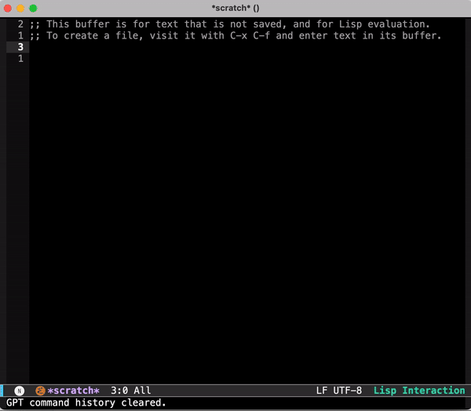
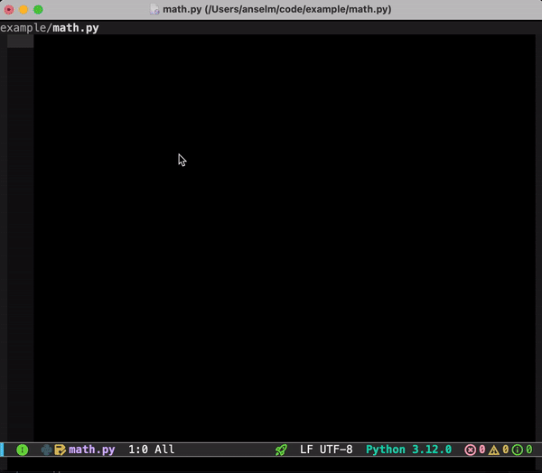
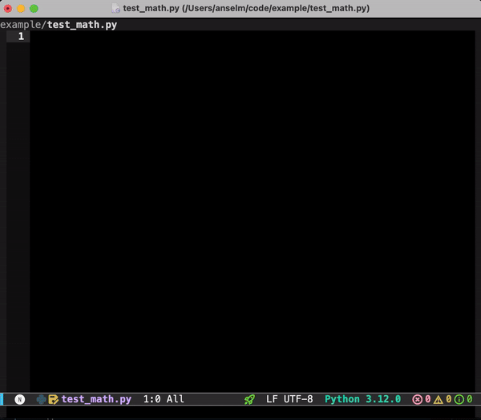
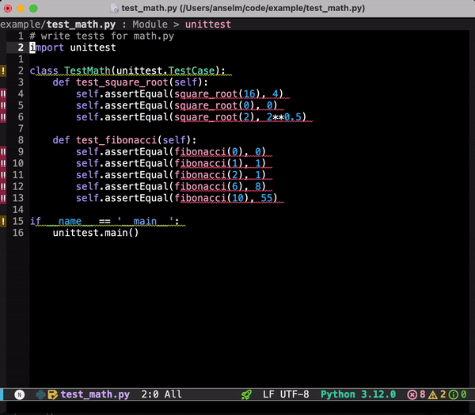
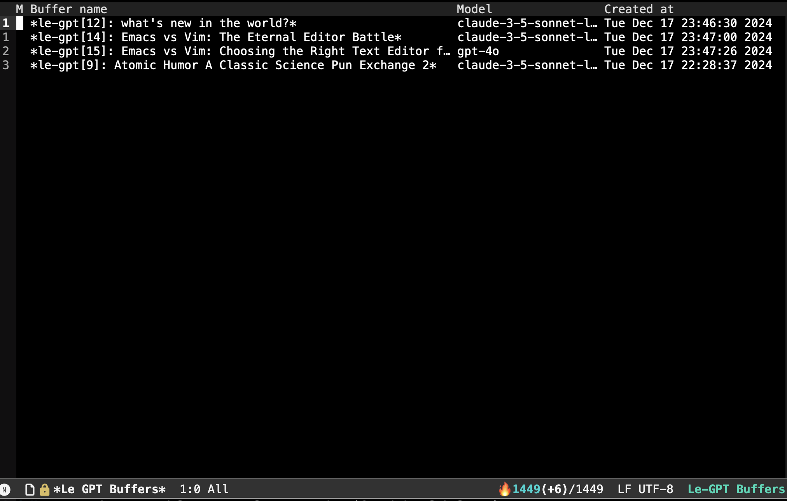

<p align="center">
    
</p>

# le-gpt.el
[](https://melpa.org/#/le-gpt)

le-gpt.el is a comprehensive Emacs package for interacting with large language models from OpenAI, Anthropic, and Deepseek. It's a feature-rich fork of [gpt.el](https://github.com/stuhlmueller/gpt.el) that adds project awareness, completion, region transform, and more to come.

The aim is to make sure Emacs stays up-to-date with modern GPT support, essentially aiming for a CursorAI for Emacs.

## Changelog

  - 0.5.0: Add buffers as context; remove global context file support.
  - 0.4.0: Add DeepSeek support

## Features


- **Chat Interface**: Create and manage multiple chat sessions with GPT. Use `M-x le-gpt-chat` to start a session. Key bindings in chat buffers include:
  - `C-c C-c`: Send follow-up command
  - `C-c C-p`: Toggle prefix visibility
  - `C-c C-b`: Copy code block at point
  - `C-c C-t`: Generate descriptive buffer name from its content
  - `C-c C-s`: Save the current buffer

- **Chat Buffer List**: Display a list of all GPT chat buffers with `M-x le-gpt-list-buffers`. 
This feature allows you to manage and navigate through your GPT-related buffers efficiently.
Mark buffers you want to delete with `d`. Execute those deletions with `x`. Unmark with `u`.
You can visit a buffer in the list by hitting `RET` and refresh the list with `g r`.
Generating buffer names with gpt via `C-c C-t` also works in the buffer list.

- **Save & load chats**: Save a chat when visiting a buffer (or in the buffer list) with `C-c C-s` (or `M-x le-gpt-chat-save-buffer` and `M-x le-gpt-buffer-list-save-buffer`, respectively).
You can load previously saved chats with `M-x le-gpt-chat-load-file`. 

- **Completion at Point**: Let GPT complete what you're currently writing. Use `M-x le-gpt-complete-at-point` to get suggestions based on your current cursor position. Suggest to bind this to a convenient key. I use `C-M-n`.

- **Region Transformation**: Select a region you want GPT to transform. Use `M-x le-gpt-transform-region` to transform the selected region using GPT. Again, I use `C-M-t` as a shortcut.

- **Context**: Select files from your project and buffers that GPT should use as context. 
You can select per-command context by running the above commands with a prefix argument (`C-u`). Context is used by chat, completion, and region transforms. 

### Mandatory GIFs

| Chat Interface                                                                   | Completion at point                                                        |
|----------------------------------------------------------------------------------|----------------------------------------------------------------------------|
|                                  |  |


| Context                                                                               | Region Transformation                                             |
|-----------------------------------------------------------------------------------------------|-------------------------------------------------------------------|
|                            |  |

...and a screenshot for a small buffer list for completeness


## Installation

### Prerequisites

You'll need Python packages for the API clients:

```bash
pip install openai anthropic jsonlines
```
You don't need to install all of them, but minimally `openai` or `anthropic`.
For `deepseek` you'll need `openai`.

You'll also need API keys from [OpenAI](https://beta.openai.com/) and/or [Anthropic](https://console.anthropic.com) and/or [Deepseek](https://platform.deepseek.com/api_keys).

You'll also need [markdown-mode](https://github.com/jrblevin/markdown-mode) for displaying the chat conversations nicely.

### Using Melpa
`le-gpt` is available via [MELPA](https://melpa.org/). 

Here's how to install it with [straight](https://github.com/radian-software/straight.el):

```elisp
(use-package le-gpt
  :bind (("M-C-g" . le-gpt-chat)
         ("M-C-n" . le-gpt-complete-at-point)
         ("M-C-t" . le-gpt-transform-region)
         ("M-C-s" . le-gpt-select-project-files)
         ("M-C-d" . le-gpt-deselect-project-files))
  :config
  ;; you need to set at least one of the following
  (setq le-gpt-openai-key "your-openai-key-here")
  (setq le-gpt-anthropic-key "your-anthropic-key-here"))
```

If you're using `evil`, you'll want to add

``` elisp
(with-eval-after-load 'evil
    (evil-define-key 'normal le-gpt-buffer-list-mode-map
      (kbd "RET") #'le-gpt-buffer-list-open-buffer
      (kbd "d") #'le-gpt-buffer-list-mark-delete
      (kbd "u") #'le-gpt-buffer-list-unmark
      (kbd "x") #'le-gpt-buffer-list-execute
      (kbd "gr") #'le-gpt-buffer-list-refresh
      (kbd "q") #'quit-window))
```

to get the above mentioned buffer list comands to work.

## Configuration

See all available customizations via `M-x customize-group RET le-gpt`.

Basic configuration:
```elisp
;; API Keys
(setq le-gpt-openai-key "sk-...")
(setq le-gpt-anthropic-key "sk-ant-...")
(setq le-gpt-deepseek-key "sk-...")

;; Model Parameters (optional)
(setq le-gpt-model "gpt-4o")
(setq le-gpt-max-tokens 2000)
(setq le-gpt-temperature 0)

;; API Selection (default is 'openai)
(setq le-gpt-api-type 'anthropic)
```

## Usage

### Context
You can add context for all of the below functionality by calling the functions with a prefix argument.
You'll then be prompted to add project files and buffers as context.

### Chat Interface

Start a chat session:
```elisp
M-x le-gpt-chat
```

### Completion at Point

Get completions based on your current cursor position:
```elisp
M-x le-gpt-complete-at-point
```

### Region Transformation

Transform selection via:
```elisp
M-x le-gpt-transform-region
```

### Buffer List

Display a list of all GPT buffers:
```elisp
M-x le-gpt-list-buffers
```

## Contributing

Contributions are welcome! Please feel free to submit issues and pull requests on GitHub.

## License

le-gpt.el is licensed under the MIT License. See [LICENSE](LICENSE) for details.

