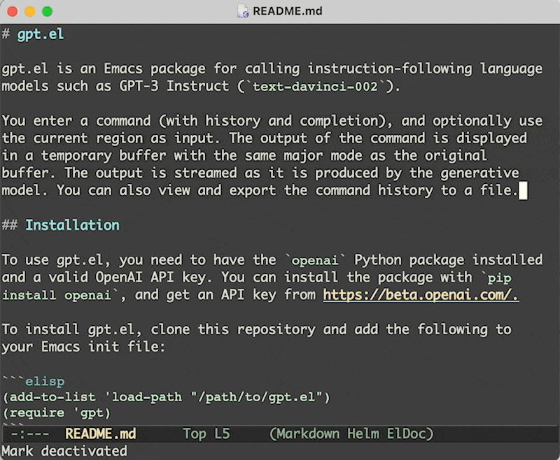

<p align="center">
  
</p>

# gpt.el

gpt.el is a simple Emacs package that lets you interact with instruction-following language models like ChatGPT and GPT-4 from your editor. You can type a natural language command (with history and completion support) and optionally use the current region as input for the model. The package displays the output of the model in a temporary buffer, and updates it as the model generates more text. You can issue follow-up commands that provide the interaction history in that buffer as context. You can also browse and save the command history to a file for later reference.

## Installation

To use gpt.el, you need to have the `openai` Python package installed and a valid OpenAI API key. You can install the package with `pip install openai`, and get an API key from https://beta.openai.com/.

### From MELPA package repository

MELPA is a popular third-party package repository for Emacs. To install gpt.el from MELPA, first add MELPA as a source in your Emacs init file:

```elisp
(require 'package)
(add-to-list 'package-archives
             '("melpa" . "https://melpa.org/packages/") t)
```

Then, use the built-in package manager to install gpt.el:

```
M-x package-install RET gpt RET
```

Once installed, you can require the package in your init file:

```elisp
(require 'gpt)
```

Alternatively, you can use `use-package`:

```elisp
(use-package gpt)
```

### From source

To install gpt.el, clone this repository and add the following to your Emacs init file:

```elisp
(add-to-list 'load-path "/path/to/gpt.el")
(require 'gpt)
```

Alternatively, you can use `use-package`:

```elisp
(use-package gpt
  :load-path "/path/to/gpt.el")
```

## Configuration

You need to set the variable `gpt-openai-key` to your OpenAI API key use gpt.el. For example:

```elisp
(setq gpt-openai-key "sk-Aes.....AV8qzL")
```

Optionally, you can customize the engine parameters by setting the variables `gpt-openai-engine`, `gpt-openai-use-chat-api`, `gpt-openai-org`, `gpt-openai-max-tokens`, and `gpt-openai-temperature`. The defaults are:

```elisp
(setq gpt-openai-engine "gpt-4")
(setq gpt-openai-use-chat-api t)
(setq gpt-openai-org "org-5p...Y")  ;; NOT SET
(setq gpt-openai-max-tokens 2000)
(setq gpt-openai-temperature 0)
```

## Usage

### Running commands

To run a generative model command, use the `gpt-dwim` function. You can bind it to a key of your choice, for example:

```elisp
(global-set-key (kbd "M-C-g") 'gpt-dwim)
```

When you invoke `gpt-dwim`, you will be prompted for a command, with history and completion. The command can be any text. For example:

```
Write a haiku about Emacs.
```

If you have an active region, it will be used as contextual input to the command. If you enter n/a as the command, only the region will be passed to the model. The output of GPT running the command will be displayed in a temporary buffer, with the same major mode as the original buffer. The output will be streamed as it is produced by the generative model. You can switch back to the original buffer at any time.

### Follow-up commands

In the gpt-output buffer, `C-c C-c` is bound to running a follow-up command that is provided the previous commands and outputs as input. For example, you can run a command "Explain this in more detail" to get more information about the previous response.

### History

You can view the command history by calling `gpt-display-command-history`, which will show the commands in a buffer. You can also export the command history to a file by calling `gpt-export-history`, which will prompt you for a file name.

## License

gpt.el is licensed under the MIT License. See [LICENSE.md](LICENSE.md) for details.
